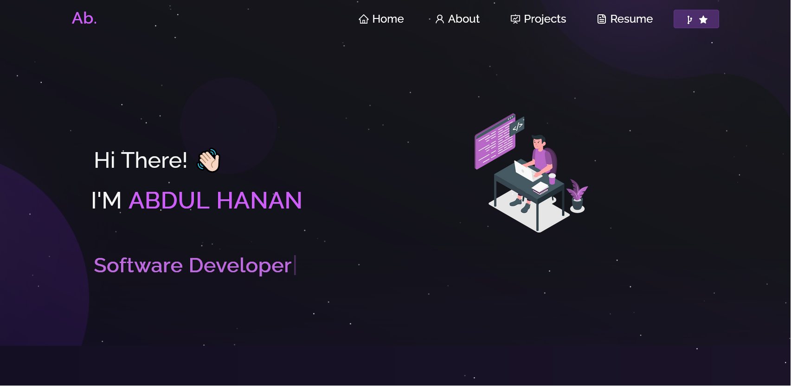

<h2 align="center">
 
Welcome to my awesome portfolio website! This website showcases my projects, skills, and experiences in a sleek and modern design. Built using React, this portfolio showcases my skills and provides visitors with an insight into my journey as a developer and the exciting projects I've worked on.

  <a href="ahmohil.github.io/portfolio" >Porfolio</a>
</h2>

  

 

<h3 align="center">
    🔹
    <a href="https://github.com/ahmhil/Portfolio/issues">Report Bug</a> &nbsp; &nbsp;
    🔹
    <a href="https://github.com/ahmohil/Portfolio/issues">Request Feature</a>
</h3>

## Features

- **Project Showcase:** Browse through a curated selection of my projects, each highlighting different skills and technologies.
- **About Me:** Get to know me better through a brief introduction and summary of my background.
- **Skills:** Discover the technologies I'm proficient in through a visually appealing skills section.
- **Responsive Design:** Enjoy a seamless experience on various devices, ensuring that my portfolio looks great everywhere.

## Getting Started

Explore my portfolio and learn about my journey by either visiting the link https://ahmohil.github.io/portfolio or cloning this repo and running it locally.

